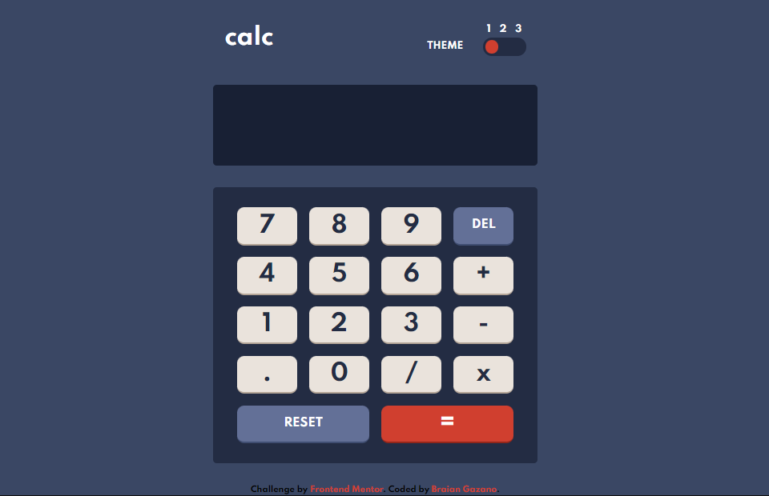
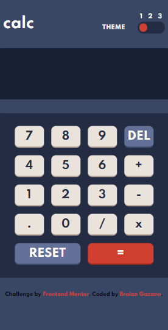
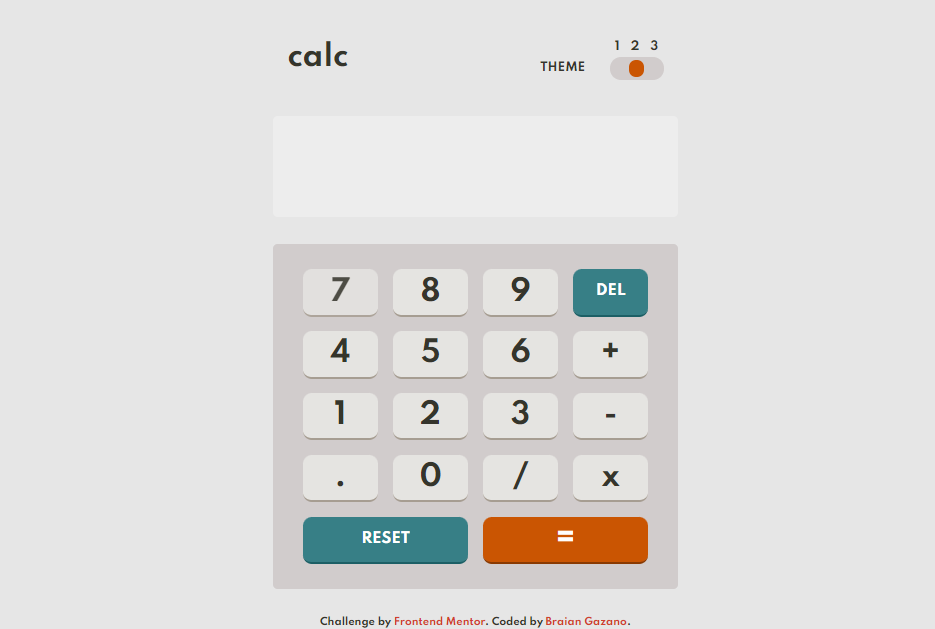
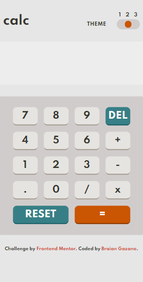
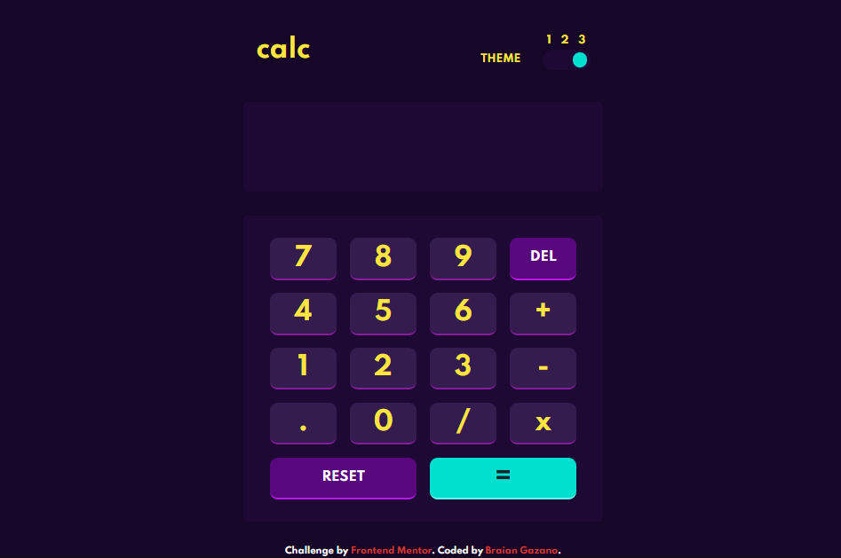
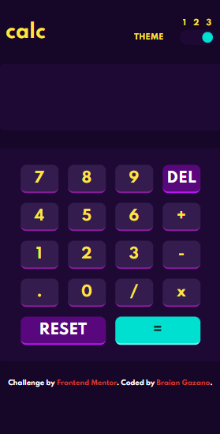

# Frontend Mentor - Calculator app solution

Esta es la solución para: [Calculator app challenge on Frontend Mentor](https://www.frontendmentor.io/challenges/calculator-app-9lteq5N29).

## Table of contents

- [Overview](#overview)
  - [The challenge](#the-challenge)
  - [Screenshot](#screenshot)
  - [Links](#links)
- [My process](#my-process)
  - [Built with](#built-with)
  - [What I learned](#what-i-learned)
  - [Continued development](#continued-development)
  - [Useful resources](#useful-resources)
- [Author](#author)

## Overview

### The challenge

Los usuarios serán capaces de:

- Ver en una interfaz optima segun el dispositivo que se utilice
- Realizar cálculos de suma, resta, multiplicación y división de números enteros además de cálculos con decimales
- Intercambiar entre tres temas distintos

### Screenshot

### Links

- URL Solución: [Todo App Main Frontend Mentor Solution](https://github.com/BraianGazano/Calculator-app)
- URL sitio desplegado: [Todo App Main Live Site](https://calculator-app-jwtvwvguu-braiangazano.vercel.app/)

## My process

### Built with

- HTML5
- CSS
- Grid
- JS

### What I learned

- Implementar la calculadora mediante POO en Javascript además de utilizar por primera vez CSS Grid

### Continued development

En el futuro planeo seguir aplicando CSS Grid en nuevos proyectos además de realizar mi portfolio personal

## Author

- Linkedin - [Braian Gazano](https://www.linkedin.com/in/braian-gazano/)
- Github - [Braian Gazano](https://github.com/BraianGazano)
